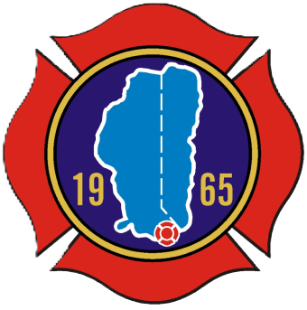
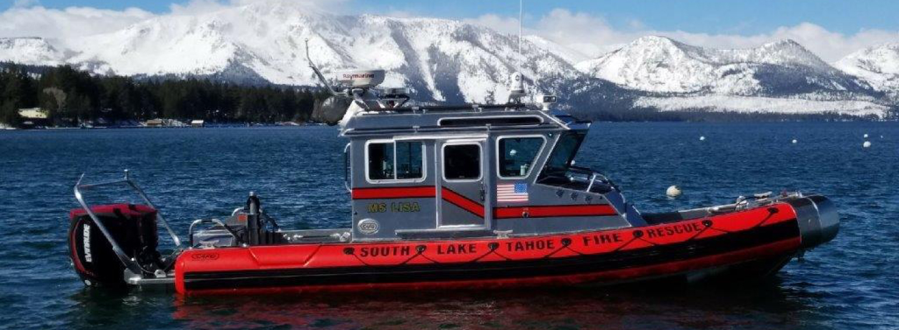

<!-- PROJECT LOGO -->
 

  

<h2 align="center">South Lake Tahoe Firefighter Foundation</h2>

<!-- ABOUT THE PROJECT -->
## About The Project

  

 **Our Client:** The Primary Mission of the South Lake Tahoe Firefighter’s Foundation is to bolster firefighter health, safety, and wellness within our community. We’re dedicated to equipping our local heroes with the tools, training, and resources they need to respond to emergencies effectively while prioritizing their own well-being.  

**The Project:** Create a website for the South Lake Tahoe Firefighter Foundation that enables the admin user to easily update and modify select areas, such as news, events, and other key content. The site will also facilitate the distribution of information, including newsletters and announcements, and provide functionality for managing donations and processing orders through an integrated storefront.

### Built With

* [![Next][Next.js]][Next-url]

## Prototype Images

<!-- Testing -->
## Testing
placeholder for 191
<!-- b -->
## Deployment
placeholder for 191
<!-- c -->
## Developer Instructions 
placeholder for 191

<!-- ROADMAP -->
## Roadmap

- [ ] About Us Page
    - [ ] Create frontend with images for staff/shifts
    - [ ] Connect frontend to backend
- [ ] Calendar Page
    - [ ] Design a fully functional news calendar
    - [ ] Enable RSVP for events
    - [ ] Connect to database to allow admin to edit events
- [ ] Donation Page
    - [ ] Create frontend for easy to use donation payments
    - [ ] Connect to Paypal API for payment processing
    - [ ] Connect to backend to send confirmation info to client and user
- [ ] Store Page
    - [ ] Create frontend for fully functional store with merchandise
    - [ ] Connect merch to backend to allow admin to edit store
    - [ ] Create checkout and confirmation pages

<!-- MARKDOWN LINKS & IMAGES -->
<!-- https://www.markdownguide.org/basic-syntax/#reference-style-links -->

[Next.js]: https://img.shields.io/badge/next.js-000000?style=for-the-badge&logo=nextdotjs&logoColor=white
[Next-url]: https://nextjs.org/

