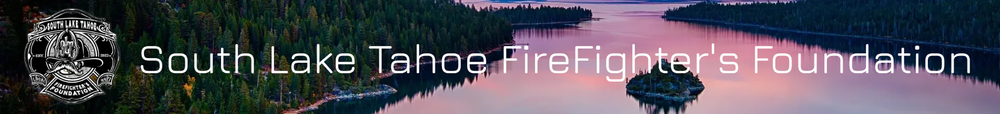
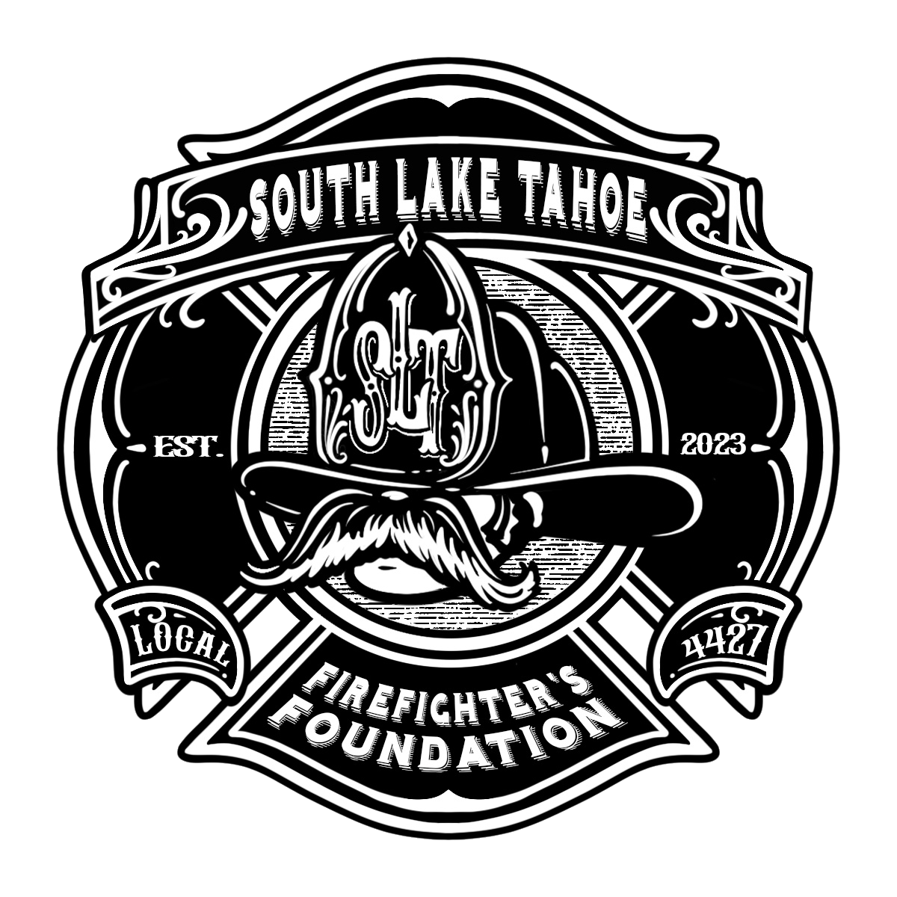

<!-- PROJECT LOGO -->
<br />
<div align="center">
  <a href="https://github.com/github_username/repo_name">
    
  </a>

</div>


<!-- ABOUT THE PROJECT -->
## About The Project

  <a href="https://github.com/github_username/repo_name">
    
  </a>


<br>**Our Client:** The Primary Mission of the South Lake Tahoe Firefighter’s Foundation is to bolster firefighter health, safety, and wellness within our community. We’re dedicated to equipping our local heroes with the tools, training, and resources they need to respond to emergencies effectively while prioritizing their own well-being.  


**The Project:** Create a website for the South Lake Tahoe Firefighter Foundation that enables the admin user to easily update and modify select areas, such as news, events, and other key content. The site will also facilitate the distribution of information, including newsletters and announcements, and provide functionality for managing donations and processing orders through an integrated storefront.


### Built With

* [![Next][Next.js]][Next-url]

## Website Images


<!-- Team Members -->
## Team Members
Team Lead:   
Hussin Irfan, hirfan@csus.edu

Members:  
Alexander Fails, afails@csus.edu  
Emilio Sanchez, esanchez-sanchez2@csus.edu           
Isabella Spradling, ispradling@csus.edu  
Anh Huynh, thuyanhhuynh@csus.edu  
Chloe Linchangco, chloelinchangco@csus.edu  
Armaan Randhawa, armaanrandhawa@csus.edu  
Prabhnoor Kaur, prabhnoorkaur@csus.edu  

<!-- Testing -->
## Testing
All projects features were tested using: Playwright  
To run tests you will need to fully setup project for running on local environment

Installs:  
```bash
npm init playwright@latest
```

Run test with ui:
```bash
npx playwright test --ui
```
<!-- c -->
## Developer Instructions

**Packages needed to run locally:**

```bash
npm install
```

```bash
npm install -g @aws-amplify/cli
```

```bash
npm install react-big-calendar
```

```bash
npm install @parcel/watcher
```

```bash
npm install xlsx
```

```bash
npm install mailersend
```

```bash
npm install @paypal/checkout-server-sdk
```


<div align="center">
  <a href="https://github.com/github_username/repo_name">
    
  </a>

</div>

<!-- MARKDOWN LINKS & IMAGES -->
<!-- https://www.markdownguide.org/basic-syntax/#reference-style-links -->

[Next.js]: https://img.shields.io/badge/next.js-000000?style=for-the-badge&logo=nextdotjs&logoColor=white
[Next-url]: https://nextjs.org/

